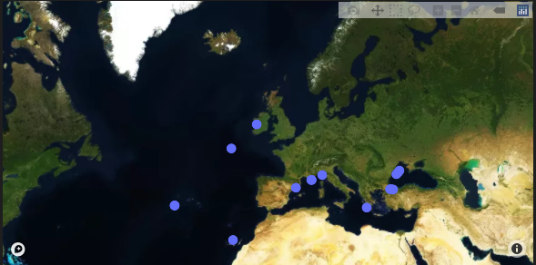
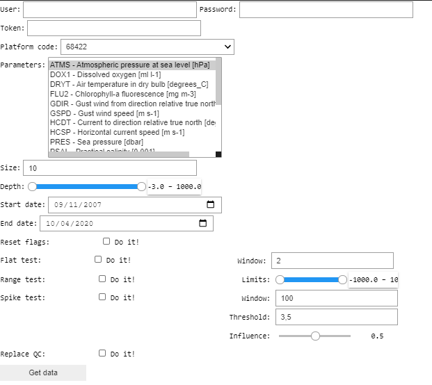

# mooda.widget_emso_qc(*wf*, *depth_range*=*[-10, 10000]*, *range_test*=*[-1000, 1000]*, *spike_window*=*100*, *spike_threshold*=*3.5*, *spike_influence*=*0.5*, *user*=*''*, *password*=*''*, *token*=*''*)

## Reference

It makes a Jupyter Notebook Widget used to download EMSO data and make data quality control tests.

### Parameters

* wf: WaterFrame
* depth_range: Range of depth (List[float])
* user:  User for the EMSO ERIC API (str)
* password:  Password for the EMSO ERIC API (str)
* token: Token for the EMSO ERIC API (str)
* parameter: Parameter (str)
* range_test: Limits for the range test [min value, max value] (List[float])
* spike_window: Window for the spike test (int)
* spike_threshold: Float for the spike test (float)
* spike_influence: Influence of the bad data on the spike test (float)

### Returns

* main_box: Jupyter notebook widget (ipwidgets.VBox)

## Example

```python
import mooda as md

wf = md.WaterFrame()

gui = md.widget_emso_qc(wf)
gui
```

Output:




Return to [Index](../../index_api_reference.md).
