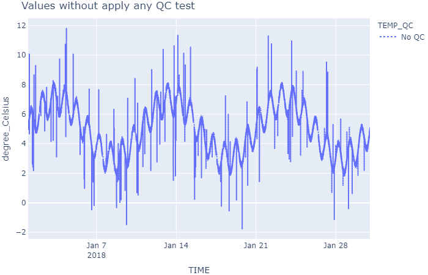
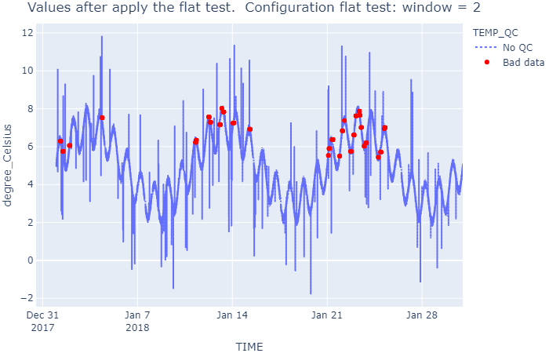
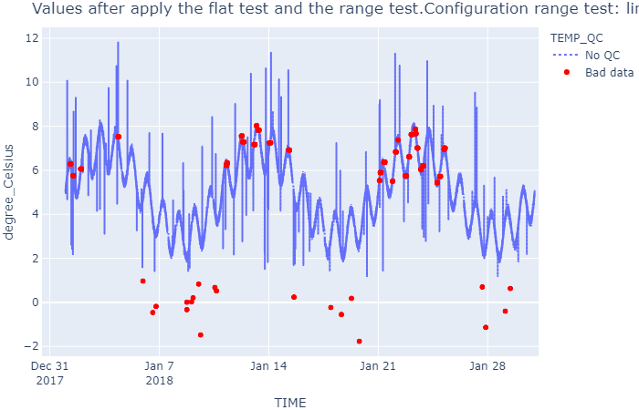
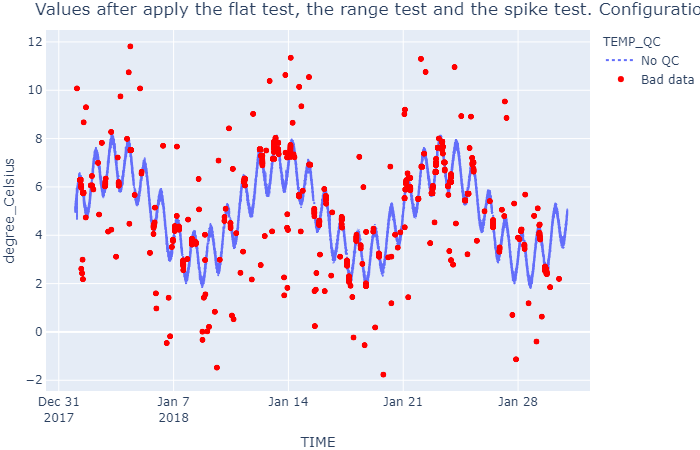
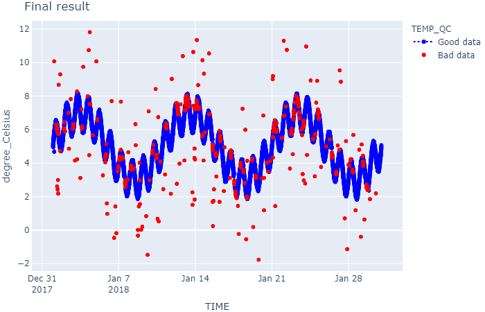

# Applying QUARTOD QC tests to Water Temperature dataset

Following the [QUARTOD manual for T&S data](https://ioos.noaa.gov/ioos-in-action/temperature-salinity/), five QC tests are listed as “required”, three as “strongly recommended”, and five as “suggested”. Here below the details for all these tests. 

**Required tests**

1. Timing/Gap Test: Check for arrival data.
2. Syntax Test: Expected data sentence received absence of parity errors
3. Location test: Check for acceptable geographic location
4. Gross Range Test: Data point exceeds sensor or operator selected min/max
5. Climatology Test: Test that data point falls within seasonal expectations

**Strongly recommended tests**

6. Spike Test: Data point n-1 exceeds a selected threshold relative to adjacent data points
7. Rate of Change Test: Excessive rise/fall test
8. Flat Line Test: Invariant value

**Suggested tests**

9. Multi-Variate Test: Comparison to other variables
10. Attenuated Signal Test: Inadequate variation test
11. Neighbor Test: Comparison to nearby sensors of the same variable
12. TS Curve/Space Test: Comparison to expected TS relationship
13. Density Inversion Test: Checks that density increases with pressure (depth)

MOODA contains functionalities to perform some of the tests proposed by QUARTOD. The QC tests implemented in MOODA are as follows:

* [Range test](../api_reference/waterframe/qc/qc_range_test.md): Flag out-of-range values. With the range test, we can perform the *4th* and *5th* of the QUARTOD tests.
* [Spike test](../api_reference/waterframe/qc/qc_spike_test.md): We can complete the *6th* of the QUARTOD tests.
* [Flat test](../api_reference/waterframe/qc/qc_flat_test.md): We can perform the *8th* of the QUARTOD tests.

QUARTOD test number *1*, *2*, *3*, *7*, *9*, *10*, *11*, *12* and *13* need to be developed with MOODA.

The following script uses the [test_qc.pkl](./data/test_qc.pkl) dataset, generated with the example [Create a waterframe with fake data to evaluate the Quality Control Tests](fake_waterframe.md). The dataset contains water temperature values (TEMP parameter) and has not yet passed any quality control tests, so all indicators are at 0 (all TEMP_QC values are 0).

The script will *flag* the values **without QC** with a **0**, values that have passed **OK** the tests correctly with a **1**, and values that have passed **KO** the test with a **4**.

Note that MOODA QC test only flags values that have not passed the test, leaving the "good values" with the original indicator. For this reason, it is recommended that initially all QC values be at 0, make the tests, and finally use the WaterFrame.replace() method to replace values that are still at 0, to 1.

The script first declares some configuration variables for the tests and then defines the function *show_results()*, which creates the graphs to analyze the results. Subsequently, the main code begins, where the dataset is opened, and QC tests are performed.

```python
import mooda as md

# Configuration variables
dataset_location = r'.\docs\examples\data\test_qc.pkl'
# QC tests
## Flat test
window_flat = 2
## Range test
limits = [1, 40]
## Spike test
window_spike = 100
threshold = 3.5
influence = 0.5

def show_result(wf, chart_title=''):
    # Change name of flags
    wf2 = wf.copy()
    qc_labels = {0: 'No QC', 1: 'Good data', 4: 'Bad data'}
    wf2.data['TEMP_QC'].replace(qc_labels, inplace=True)

    fig = wf2.iplot_line(
        'TEMP',
        color='TEMP_QC',
        marginal_y=None,
        line_shape='linear',
        rangeslider_visible=False,
        line_dash_sequence=['dot', 'dot'],
        title=chart_title)
    fig.show()

# Main code

## Open file
wf = md.read_pkl(dataset_location)
show_result(wf, 'Values without apply any QC test')

## QC tests
### Flat test
wf.qc_flat_test()
show_result(
    wf, 'Values after apply the flat test. ' + \
        f' Configuration flat test: window = {window_flat}')
### Range test
wf.qc_range_test(limits=limits)
show_result(
    wf, 'Values after apply the flat test and the range test.' + \
        f'Configuration range test: limits = {limits}')
### Spike test
wf.qc_spike_test(window=window_spike, influence=influence, threshold=threshold)
show_result(
    wf, 'Values after apply the flat test, the range test and the spike test.' + \
        f' Configuration spike test: window = {window_spike}, influence = {influence}, ' + \
        f'threshold = {threshold}')
## It replaces the QC values that are still 0, to 1
wf.qc_replace()
show_result(wf, f'Final result')
```

Output:







Return to the [Index of examples](index_examples.md).